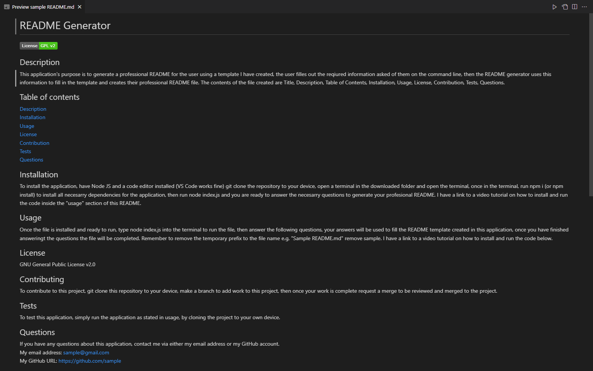

# README Generator   
 
## Description  
This application's purpose is to generate a professional README for the user using a template I have created, the user filles out the reqiured information asked of them on the command line, then the README generator uses this information to fill in the template and creates their professional README file. The contents of the file created are Title, Description, Table of Contents, Installation, Usage, License, Contribution, Tests, Questions.  

## Table of contents
[Description](#description)  
[Installation](#installation)  
[Usage](#usage)  
[License](#license)  
[Contribution](#contribution)  
[Tests](#tests)  
[Questions](#questions)  
## Installation  
To install the application, have Node JS and a code editor installed (VS Code works fine) git clone the repository to your device, open a terminal in the downloaded folder and open the terminal, once in the terminal, run npm i (or npm install) to install all necesarry dependencies for the application, then run node index.js and you are ready to answer the necesarry questions to generate your profesional README. I have a link to a video tutorial on how to install and run the code inside the "usage" section of this README.  
## Usage  
Once the file is installed and ready to run, type node index.js into the terminal to run the file, then answer the following questions, your answers will be used to fill the README template created in this application, once you have finished answeringt the questions the file will be completed. Remember to remove the temporary prefix to the file name e.g. "Sample README.md" remove sample. I have a link to a video tutorial on how to install and run the code below.  

[Link to video tutorial](https://drive.google.com/file/d/1A6MKKjWGL1dm6M3-hGjNkNigT6U_0ubw/view?usp=share_link)
## License  
N/A
## Contributing  
To contribute to this project, git clone this repository to your device, make a branch to add work to this project, then once your work is complete request a merge to be reviewed and merged to the project.
## Tests  
To test this application, simply run the application as stated in usage, by cloning the project to your own device.  
## Questions  
If you have any questions about this application, contact me via either my email address or my GitHub account.  
My email address: jakeorchard@live.co.uk  
My GitHub URL: https://github.com/Jake-Orch
